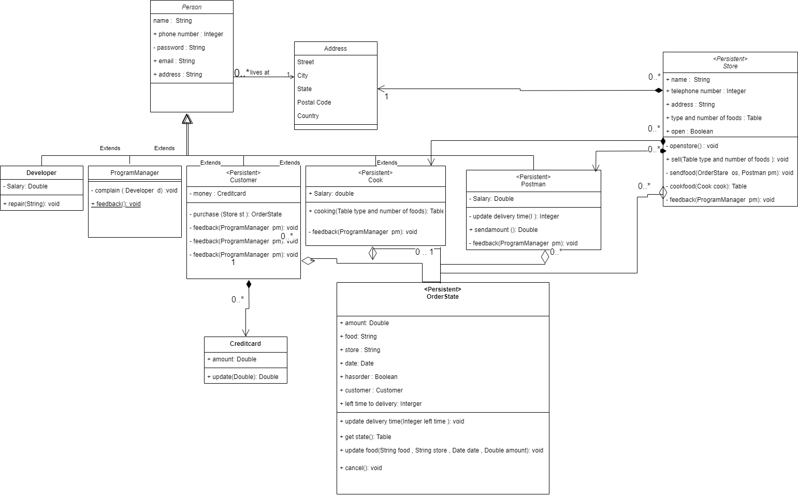
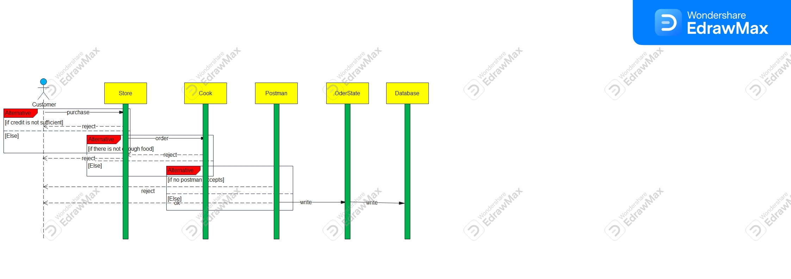
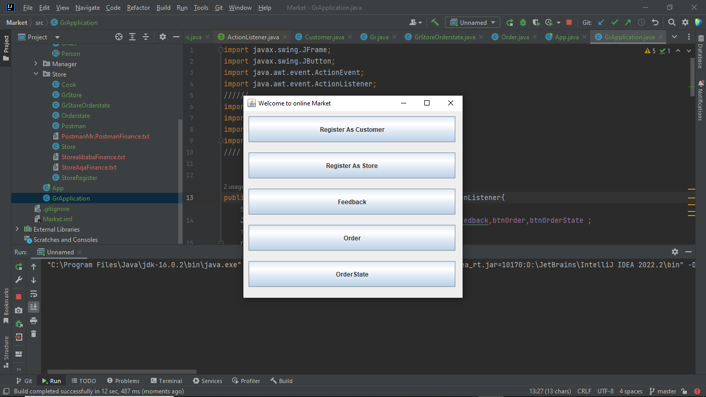
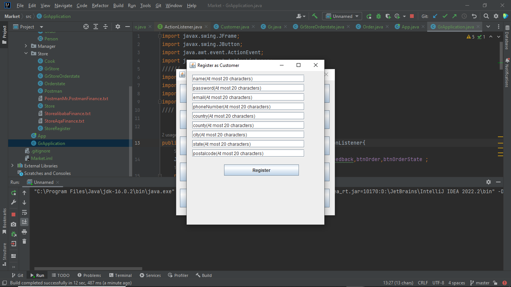
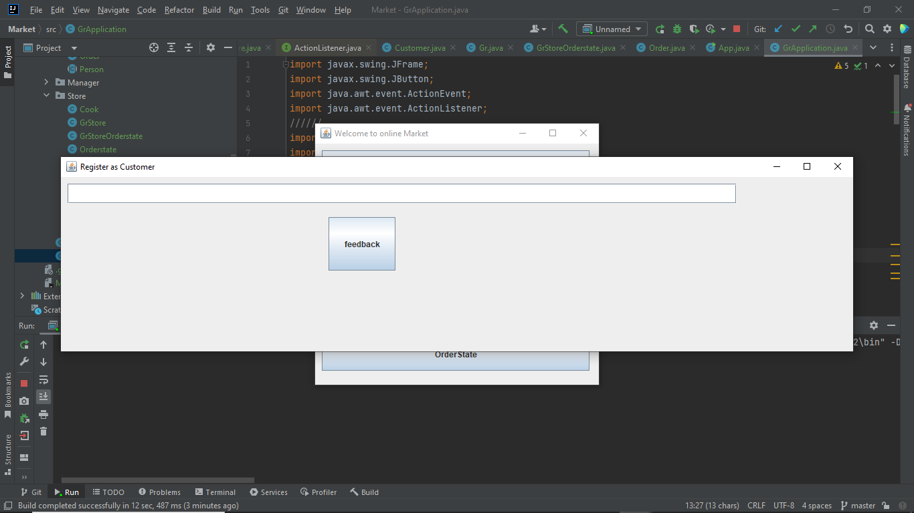
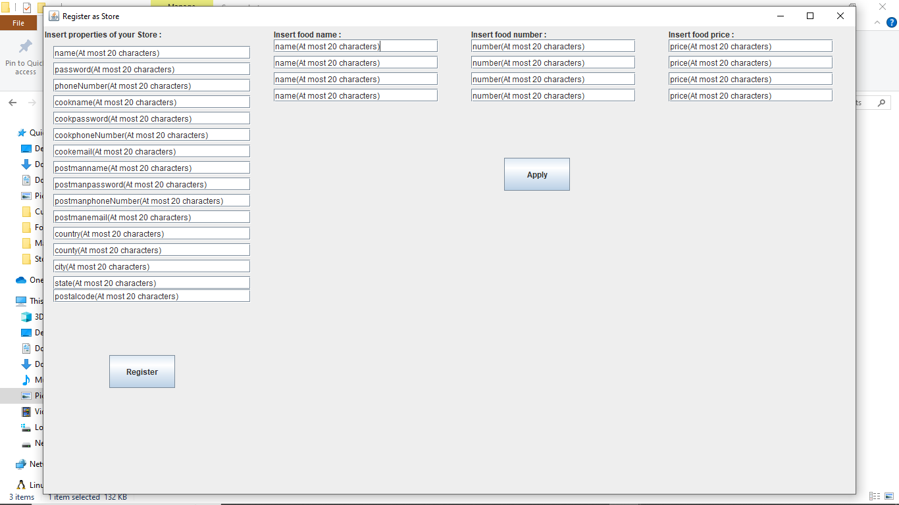
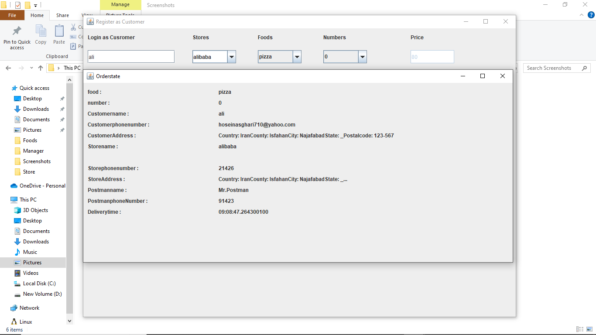

# Market
We have developed our Ap-Project 5 parts:\
1-part:\
  we made some classes and their attributes and methodes as you can see in the "ap-project-phase0-99107838pdf".\
2-part:\
 we made some user cases and use cases as an objects and some descriptions corresponding.and you can see in the "ap-project-phase1-99107838.pdf"\
3-part:\
 we made Class Diagram and then specify Persistant classes as entity.and you can see in the "ap-project-phase2-99107838.pdf"\
 \
 \
 
 \
 \
4-part:\
   then we made a sequence diagram . because of that edrawmax do not have User interface Shape we could not implement it . and you can see in the "ap-project-phase2-99107838.pdf"\
   \and the image is as follows:\
   \
   \

\
\
\and finally we used Java to implements our Projects:\
\
at first let take look at what do we have in our src dolder:\
# App.java:
it is our main class and only and only this class has main method . so it is the gate of our application. it means if we want to tun this we must at first run App.java\
# GrApplication.java:
it makes a GUI for us to register , order and feedback.\

# afterwards we go to Customer package :
# Address.java:
which only has some fields and a cunstructor to initialize those fields.\
# Person.java:
it is an abstract class with only some fields that our user cases extends it.\
 # Customer.java :
this class extends Person.java and consists of some field and method related to its salary. and finaly a file as history of his wages from Store.\
this class is a persistant class and has shown with @Entity.
# CustomerRegister.java :
it does nothing except of make an instance of Gr.java.\
# Gr.java :
it makes a GUI to register as Customer.\

# Order.java :
after registration of customers and Stores you can go to this class and make an order as a customer from your desired store and then it makes \
changes in files in directory Manager\Foods\* . in this directory we have some information about menu of each stores.\
as well , in directory Manager\* we have an important files named "Storeslogin.txt ", "Customerslogin.txt" and "FeedbacksOfUsers.txt" inwhich they give us persistent\
information about database.\

# then we go to Manager package :

in directory Manager\Foods\* . in this directory we have some information about menu of each stores.\
as well , in directory Manager\* we have an important files named "Storeslogin.txt ", "Customerslogin.txt" and "FeedbacksOfUsers.txt" inwhich they give us persistent\
information about database.\
as well we have class :\
# "Feedback.java:" 
which is very simple class only to records complaints from customers or store owners.\
this class is a persistant class and has shown with @Entity.\

# then we go to Store package :
# Cook.java
this class extend "Person.java" and has some methods and fields related to salary of this person.\

# Store.java :
this class is very important and has field related to registration of this class and it makes instance of "Postman.java" and "Cook.java" as personels.\
it also manages very important files such as "Storeslogin.txt ". it has access to methods of "Postman.java" and "Cook.java" and it determines their salary.\
this class is a persistant class and has shown with @Entity.

# Postman.java:
this class extend "Person.java" and has some methods and fields related to salary of this person.\
it has also some methodes to calculate time of delivery according to address of customer and address of postman and consequently it calculates deliverytime according to\
distance between these two objects .\

# StoreRegister.java:
it does not do anything special. it just makes an instance from Grstore.java.\
 # Grstore.java:
it makes a GUI for us to register an Store and calculate the salary of Cook.this class is very important and it is very complicated with many graphical objects.\

# Orderstate.java:
this class is production of all other classes and conrains only field  and make for us a complete list for our order.\
this class is a persistant class and has shown with @Entity.\

# GrOrderstate.java:
this class makes a graphical view of "Orderstate.java".\
it complete for us "Storeslogin.txt ".\
this class is a persistant class and has shown with @Entity.\

